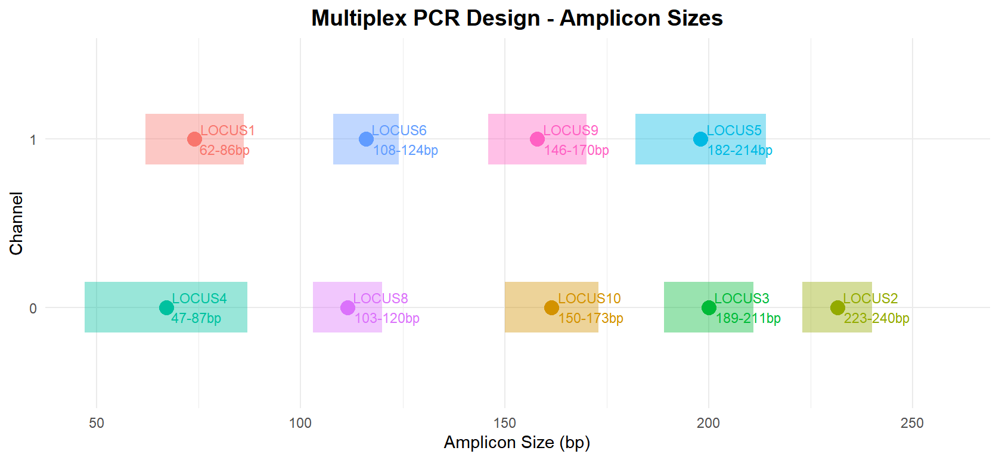
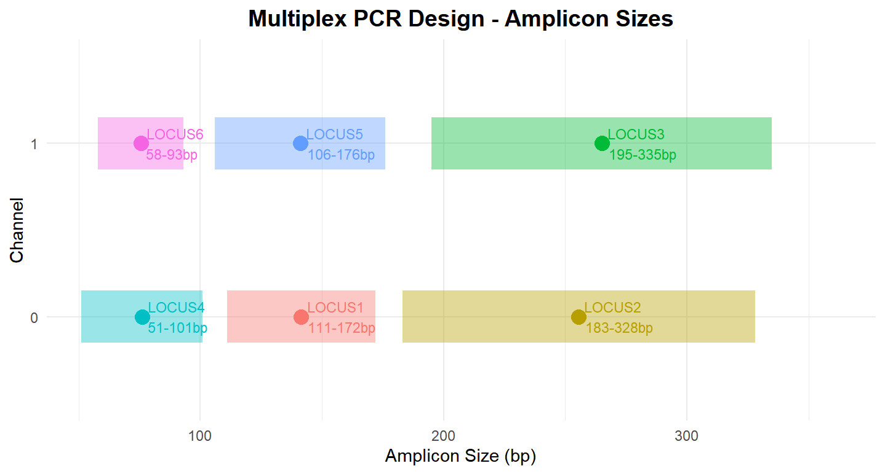
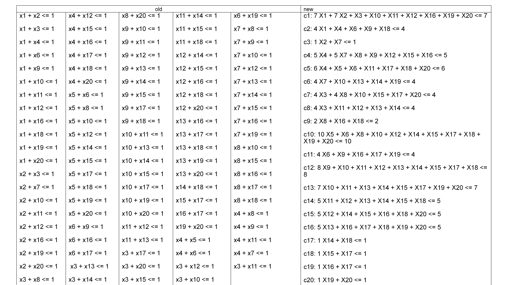

``` markdown

# multiplexILP: Multiplex PCR Design Using Integer Linear Programming


## Overview

`multiplexILP` is an R package for designing multiplex PCR assays using Integer Linear Programming (ILP). It leverages mathematical optimization to select optimal primer sets, addressing key challenges such as primer compatibility, multi-channel fluorescence assignment, and amplicon size optimization in multiplex PCR experiments.

### Key Features
- Generate ILP models for **single-primer** and **primer-pair** selection strategies
- Optimize constraints via independent set analysis for improved computational efficiency
- Parse solutions from popular ILP solvers (e.g., **SCIP**)
- Visualize selected primer pairs and channel assignments
- Support for multiple fluorescence channels, amplicon size ranges, and annealing temperature constraints

## Installation

### Prerequisites
- R (>= 3.5.0)
- A C++11 compatible compiler (GCC, Clang, or Rtools for Windows)
- **SCIP Solver** (>= 8.0.0) [Download](https://www.scipopt.org/)

### Install Dependencies
```r
# Install CRAN packages
install.packages(c("Rcpp", "ggplot2", "dplyr", "stringr", "devtools"))
```

### Install the Package

``` r

# From GitHub (replace 'username' with actual repo owner)
library(devtools)
install_github("limeng/multiplexILP")
```

## Quick Start

### 1. Single Primer Approach

``` r

library(multiplexILP)

# Generate simulated data
primer_data <- generate_single_primer_data(
  n_primers = 150,
  n_loci = 10,
  num_channels = 2,
  size_gap = 10,
  seed = 123
)

# Generate ILP model
ilp_output <- gen_ilp_single_primer(primer_data)

# Solve with SCIP (ensure SCIP is in PATH)
system(paste0("scip -f ", ilp_output$lp_file, " -l sol.txt"))

# Parse results
parsed_results <- parse_scip_single_primer_solution(
  scip_output_file = "sol.txt",
  primers_info_file = ilp_output$primers_info_file,
  output_prefix = "single_primer_analysis"
)

# Visualize
plots <- generate_simple_plots(parsed_results$selected_primer_pairs, "single_primer_report")
plots$amplicon_plot
```



### 2. Primer Pair Approach

``` r

library(multiplexILP)

# Generate simulated data
primer_pair_data <- generate_primer_pair_data(
  n_pairs = 500,
  n_loci = 6,
  num_channels = 2,
  size_gap = 10,
  seed = 1123
)

# Generate ILP model
ilp_output <- gen_ilp_primer_pair(primer_pair_data, lower_bound = 0)

# Solve with SCIP
system(paste0("scip -f ", ilp_output$lp_file, " -l sol.txt"))

# Parse results
parsed_results <- parse_scip_locus_C_kt_solution(
  scip_output_file = "sol.txt",
  primers_info_file = ilp_output$primers_info_file,
  output_prefix = "primer_pair_analysis"
)

# Visualize
plots <- generate_simple_plots(parsed_results$selected_primers, "primer_pair_report")
plots$amplicon_plot
```



### 3. Constraint Optimization

``` r

library(multiplexILP)
library(stringr)

# Generate raw constraints
raw_constraints <- gen_cons(n = 60, percent = 0.9)

# Optimize constraints
optimized_cons <- convert_constraints(raw_constraints)

cat("Original:", length(raw_constraints), "constraints\n")
cat("Optimized:", length(optimized_cons), "constraints\n")
```



### Single Primer Model

| Variable    | Type   | Description                                           |
|------------------------|------------------------|------------------------|
| $X_i$       | Binary | Indicates if primer $i$ is selected                   |
| $P_k$       | Binary | Indicates if locus $k$ is selected                    |
| $C_{k,t}$   | Binary | Assigns locus $k$ to channel $t$                      |
| $D_{k,l}$   | Binary | Indicates if loci $k$ and $l$ are in the same channel |
| $E_{k,l,t}$ | Binary | Auxiliary variable for linearization                  |
| $Z_k$       | Binary | Indicates if locus $k$ is not selected                |

### Primer Pair Model

| Variable  | Type   | Description                                           |
|-----------|--------|-------------------------------------------------------|
| $Y_i$     | Binary | Indicates if primer pair $i$ is selected              |
| $C_{k,t}$ | Binary | Assigns locus $k$ to channel $t$                      |
| $D_{k,l}$ | Binary | Indicates if loci $k$ and $l$ are in the same channel |
| $Z_k$     | Binary | Indicates if locus $k$ is not selected                |

## Output Files

The package generates the following files:

-   `.lp`: ILP model file for SCIP solver

-   `.tsv`: Primer information file with indices and properties

-   `.txt`: Parsed solution file with selected primers/channels

-   `.pdf`: Visual report of amplicon sizes and channel assignments

## Troubleshooting

### Common Issues

1.  **SCIP not found**: Ensure SCIP is installed and the `scip` executable is in your system `PATH`.

2.  **Compilation errors**: Verify a C++11 compiler is installed and configured with R.

3.  **Memory issues**: Use `convert_constraints()` to reduce the number of constraints for large datasets.

## License

This project is licensed under the **GPL-3 License** - see the [LICENSE](LICENSE) file for details.
